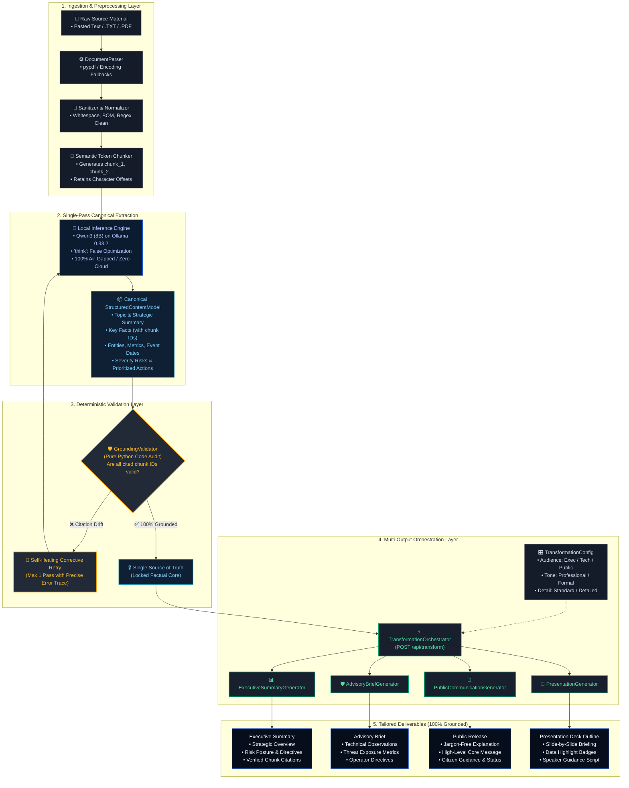
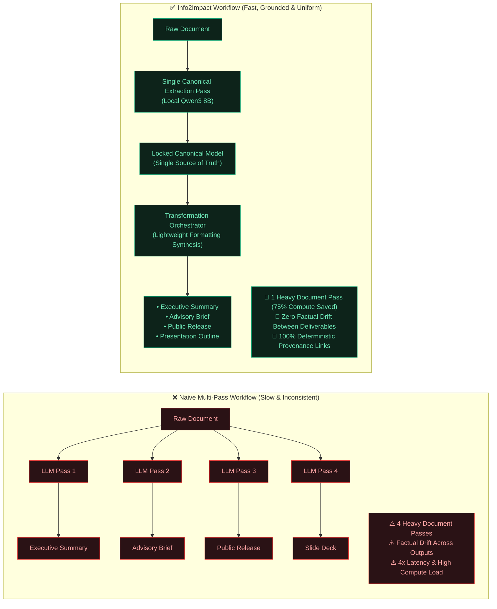
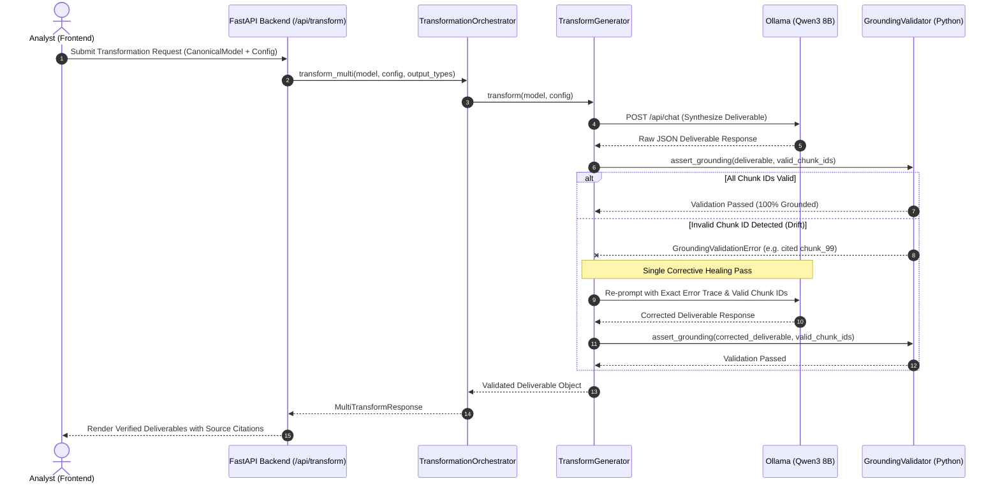

# Info2Impact — GenAI Platform for Automated Content Transformation

[](https://sih.gov.in/)
[](https://sih.gov.in/)
[](https://ntro.gov.in/)
[]()
[]()
[]()
[]()

> **Team Name:** Innov8  
> **Solution Codename:** Info2Impact  
> **Deployment Architecture:** 100% On-Premise, Air-Gapped Sovereign AI  

---

## 📌 Executive Summary

Organizations handling critical intelligence—such as the **National Technical Research Organisation (NTRO)**, defense commands, and critical infrastructure authorities—frequently ingest voluminous, dense technical documents (cyber incident telemetry, threat intelligence feeds, SCADA intrusion logs, regulatory policy directives). 

Currently, technical analysts must **repeatedly read and manually rewrite** the same source material for distinct audiences:
- **Leadership / Command Staff:** Require high-level strategic summaries, impact assessments, and decision matrices.
- **Field Engineers & Operators:** Require actionable technical advisories, containment directives, and exact CVE/configuration parameters.
- **General Public & Media:** Require clear, reassuring, plain-language notices without technical jargon.
- **Presenters & Briefers:** Require slide decks with speaker notes and bulleted highlights.

This manual workflow causes **severe communication latency**, introduces **human drafting errors**, and results in **dangerous factual drift** across documents.

**Info2Impact** solves this through a **"Understand Once, Transform Many"** architecture:
1. Ingests source documents (pasted text, TXT, PDF) and breaks them into deterministic, addressable semantic chunks (`chunk_1`, `chunk_2`...).
2. Performs a **single-pass canonical factual extraction** using a local, air-gapped Large Language Model (**Qwen3 8B via Ollama**) to construct a `StructuredContentModel`.
3. Verifies every claim deterministically using a pure Python **`GroundingValidator`** (with automated single-pass healing retry).
4. Generates all requested audience deliverables from the **same canonical model** without re-analyzing the raw source text.

---

## 📊 System Architecture & Flowcharts

### 1. End-to-End System Pipeline Flowchart

The following flowchart illustrates the entire data lifecycle from multi-modal source ingestion through canonical extraction, deterministic validation, orchestration, and output delivery:



---

### 2. "Analyze Once, Transform Many" vs. Naive Multi-Pass Architecture

Traditional AI chatbots prompt the raw document repeatedly for each desired output, compounding latency, token consumption, and factual hallucination. Info2Impact decouples extraction from synthesis:



---

### 3. Deterministic Grounding & Self-Healing Decision Loop



---

## 🎨 Institutional UI/UX (Stitch Design System)

The frontend features an institutional dark-mode command workspace engineered for high-stakes intelligence synthesis, regulatory oversight, and emergency operational briefings (Stitch Project ID: `18006031842370717932`):

| Stage | Workspace View | Core Capability |
| :---: | :--- | :--- |
| **Stage 1** | **Source Ingestion** | Drag & drop PDF/TXT or paste raw intelligence text. Includes instant sample loader for the **NTRO SCADA Grid Intrusion** dossier. |
| **Stage 2** | **Understand & Provenance** | Visualizes the extracted canonical factual model. Includes the **Forensic Source Inspector**—click any fact or chunk pill to view exact source text, page numbers, and character offsets. |
| **Stage 3** | **Configure Transformation** | Adjust Target Audience (*Executive, Technical, General Public, Analyst*), Tone (*Professional, Formal, Informative, Concise*), Detail Level, and Objective. Multi-select desired deliverables. |
| **Stage 4** | **Orchestration Telemetry** | Displays real-time progress, pipeline state, and local model inference telemetry. |
| **Stage 5** | **Review & Deliverables** | Tabbed inspection across all generated outputs with inline citation tags linking claims back to source chunks. |

---

## 🛠️ Technology Stack & Dependencies

| Component | Technology | Version | Purpose |
| :--- | :--- | :--- | :--- |
| **Local LLM Engine** | **Ollama** | `v0.33.2` | Local air-gapped inference engine |
| **Model Weights** | **Qwen3 (8B)** | `8B-Instruct` | High-reasoning structured JSON extraction |
| **Backend Framework** | **Python / FastAPI** | `3.13 / 0.115+` | Asynchronous REST service & microservices |
| **Schema Validation** | **Pydantic** | `v2.10+` | Strict contract validation & Rust serialization |
| **Document Parsing** | **pypdf** | `5.0+` | Multi-page PDF text & metadata extraction |
| **Frontend Framework**| **React + Vite** | `React 18 / Vite 8` | High-velocity reactive UI |
| **Styling** | **Tailwind CSS v4** | `4.x` | High-density institutional dark-mode theme |
| **Typography** | **Google Fonts** | — | `Hanken Grotesk`, `Inter`, `JetBrains Mono` |
| **Icons** | **Material Symbols**| — | Google Material Symbols Outlined |
| **Testing** | **Pytest** | `8.x` | 97 automated test cases (100% passing) |

---

## 📡 REST API Reference

The backend exposes fully documented OpenAPI endpoints (accessible at `http://127.0.0.1:8000/docs`):

| Method | Endpoint | Description | Status Code |
| :--- | :--- | :--- | :---: |
| `GET` | `/api/health` | Health check & service discovery | `200 OK` |
| `POST` | `/api/source/ingest` | Sanitize and semantically chunk raw text | `200 OK` |
| `POST` | `/api/source/upload` | Upload `.txt` or `.pdf` document for chunking | `200 OK` |
| `POST` | `/api/ai/analyze` | Single-pass canonical extraction (`StructuredContentModel`) | `200 OK` |
| `POST` | `/api/transform` | Multi-output orchestration (generates selected outputs) | `200 OK` |
| `POST` | `/api/transform/executive-summary` | Transform canonical model into Executive Summary | `200 OK` |
| `POST` | `/api/transform/advisory-brief` | Transform canonical model into Technical Advisory Brief | `200 OK` |
| `POST` | `/api/transform/public-communication` | Transform canonical model into Public Release | `200 OK` |
| `POST` | `/api/transform/presentation` | Transform canonical model into Presentation Outline | `200 OK` |

---

## 🚀 Quick Setup & Installation

### Prerequisites
1. **Ollama** installed with `qwen3:8b`:
   ```bash
   ollama run qwen3:8b
   ```
2. **Python 3.10+** and **Node.js 18+**

### 1. Clone the Repository
```bash
git clone https://github.com/sudeep-s2/INNOV8.git
cd INNOV8
```

### 2. Backend Setup
```bash
cd backend
pip install -r requirements.txt
python -m uvicorn app.main:app --host 127.0.0.1 --port 8000 --reload
```
- API Documentation: `http://127.0.0.1:8000/docs`
- Health Endpoint: `http://127.0.0.1:8000/api/health`

### 3. Frontend Setup
```bash
cd frontend
npm install
npm run dev
```
- Web Application: `http://localhost:5173/`

---

## 🧪 Automated Testing & Verification

The platform is backed by **97 automated test cases** covering every layer of the architecture:
- Model validation & enum constraints (`test_models.py`)
- Ingestion, text sanitization & PDF parsing (`test_source_ingestion.py`)
- Ollama service parsing & corrective retry (`test_ai_service.py`)
- Deterministic chunk citation validation (`test_grounding.py`)
- Individual generators: Executive Summary, Advisory Brief, Public Communication, Presentation (`test_*.py`)
- Multi-output orchestration & partial failure isolation (`test_orchestrator.py`)
- Live Ollama Qwen3 8B integration test (`test_ollama_integration.py`)

Run the complete test suite:
```bash
cd backend
python -m pytest tests -v
```

```text
================== 97 passed, 1 warning in 163.75s (0:02:43) ==================
```

---

## 📑 Presentation & Documentation Assets

- **SIH 2026 Presentation Deck:** `Info2Impact_SIH2026_Innov8.pptx` (strict 6-slide official format).
- **Presentation Generator Script:** `generate_sih_presentation.py` (programmatic PowerPoint builder using `python-pptx`).
- **Stitch UI Project ID:** `18006031842370717932`

---

## 🛡️ License & Compliance

Built for **Smart India Hackathon 2026** under Problem Statement **SIH26154** (National Technical Research Organisation).  
Designed in alignment with the **National Data Governance Framework Policy (NDGFP)** for sovereign, air-gapped computational intelligence.
